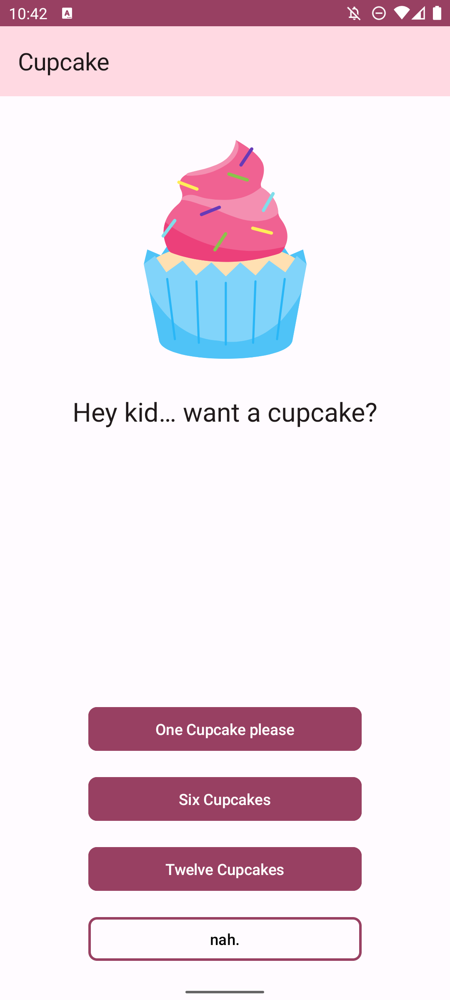

# Cupcake Order App

A simple app to learn about navigation in Jetpack Compose through a cupcake ordering process.



## Features

- **Quantity Selection**: Select the number of cupcakes to order.
- **Multiple Flavors**: Choose from a variety of cupcake flavors.
- **Pickup Date**: Choose a pickup date for your cupcake order.
- **Order Summary**: Review your cupcake order details before finalizing.
- **Share Order**: Share your cupcake order details through other apps using Android intents.

## Installation Instructions

1. [Download](https://github.com/luiisca/hey-kid/releases/download/v1.0/hey-kid.apk) the APK file.
2. Install the APK on your Android device by enabling installation from unknown sources if necessary.
3. Open the app and start navigating through the cupcake ordering process using the Jetpack Compose navigation features!

## Getting Started

To get a local copy up and running follow these simple steps.

### Prerequisites

- Android Studio installed on your machine.

### Installation

1. Clone the repo
   ```sh
   git clone https://github.com/luiisca/hey-kid.git
   ```
2. Open the project in Android Studio.
3. Build and run the app on your Android device or emulator.
